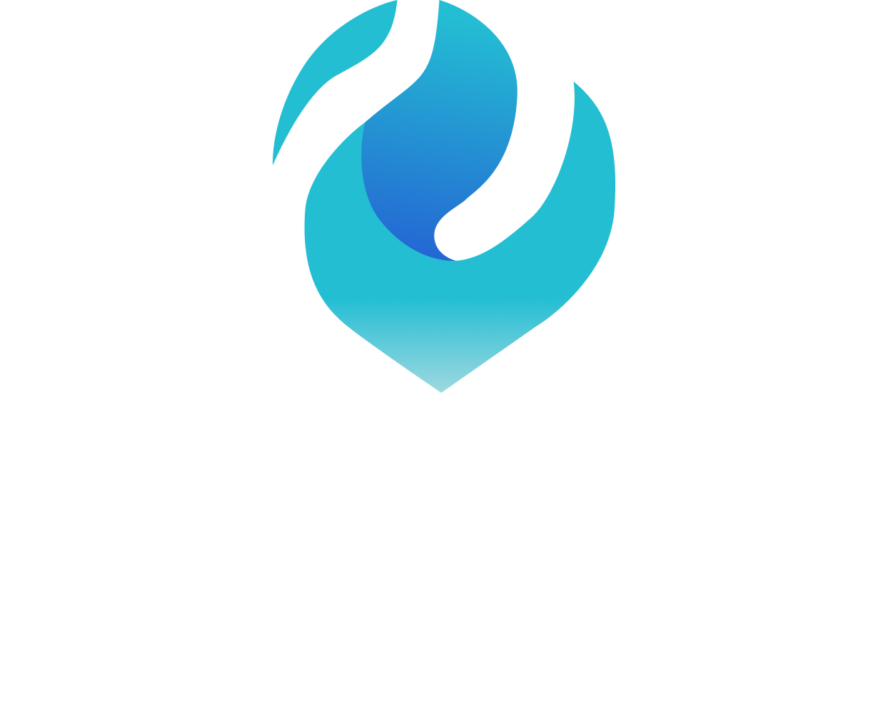

<div align="center">
    
</div>

<div align="center">
    <h1>Plataforma de Apostas em Eventos Futuros</h1>
</div>

<div align="center">
    <ul style="list-style: none; padding: 0;">
        <li><a href="#clone">Clonando</a></li>
        <li><a href="#data">Configurando Banco</a></li>
        <li><a href="#config">Configurando Variáveis</a></li>
        <li><a href="#started">Executando</a></li>
    </ul>
</div>


<details>
  <summary align="center">💻 <strong>Tecnologias</strong></summary>
  <div align="center">

• Banco de Dados Oracle e DataGrip  
• WebStorm e Visual Studio Code  
• HTML, CSS e JavaScript  
• NodeJS e Typescript

  </div>
</details>


<details>
  <summary align="center">📋 <strong>Pré-requisitos</strong></summary>
  <div align="center">

• [Structured Query Language (SQL)](https://www.oracle.com/br/database/sqldeveloper/technologies/download/)  
• [Banco de Dados Oracle](https://www.oracle.com/database/technologies/oracle21c-windows-downloads.html)  
• [WebStorm](https://www.jetbrains.com/webstorm/) ou [VSCode](https://code.visualstudio.com/)  
• [NodeJS](https://nodejs.org/pt)  
• [Git](https://git-scm.com/downloads)

  </div>
</details>


<h2 id="clone">📂 Clonando...</h2>

```bash
git clone https://github.com/JheniferLais/ProjetoIntegradorII_EngSoftware_Time8.git
```


<h2 id="data">🛢️ Configurando Banco de Dados</h2>
Execute o arquivo `Script Banco de Dados` em seu software de SQL para gerar a estrutura completa do banco de dados wager.
<p> Encontre-o em: <p>

```yaml
ProjetoIntegradorII/
└── Banco de Dados/
    ├── ...
    └── Script Banco de Dados (Oracle-SQLdeveloper)
```


<h2 id="config">⚙️ Configurando Variáveis do Ambiente .env</h2>

Use `.env.exemplo` como referência para criar seu arquivo de configuração `.env` com suas credenciais

```yaml
# Configurações de Banco de Dados
DATABASE_USER={YOUR_DATABASE_USER}
DATABASE_PASSWORD={YOUR_DATABSE_PASSSWORD}
DATABASE_STRING={YOUR_DATABASE_STRING}

# Configurações de email
EMAIL_USERNAME={YOUR_EMAIL}
EMAIL_PASSWORD={YOUR_EMAIL_PASSWORD_APP}
```

Assegure-se de organizar o arquivo `.env` no diretório correto conforme o exemplo abaixo:

```yaml
Projeto/
├── src/
│   └── ...
├── .env
├── App.ts
└── Server.ts
```


<h2 id="started">🚀 Executando o Projeto</h2>
O comando abaixo instalará todas as dependências necessárias:

```shell
npm install
```

<h3>Iniciando o servidor</h3>

na raíz do projeto `\Projeto` rode os comandos:

```shell
npm run build 
npm start
```

Como consequência, será gerado o diretório build constando os arquivos em javascript e o servidor será iniciado:

<h3>Uma alternativa...Iniciando o servidor com nodemon</h3>
O nodemon é uma alternativa que reinicia automaticamente o projeto em Node.js sempre que há alterações no código,
evitando a necessidade de rodá-lo manualmente a cada mudança:

```shell
npm run dev
```

